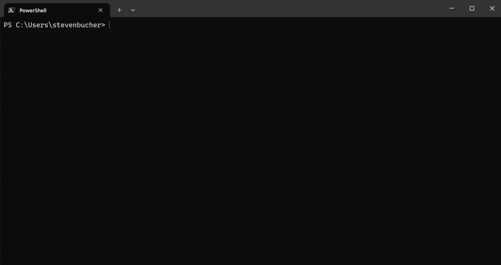

# Get started with AIShell in PowerShell

AIShell was created to help command line users find the right commands to use, recover from errors,
and better understand the commands and the output they produce. Follow along and walk through some
examples to get started with AIShell.

## Starting AIShell

Use the `Start-AIShell` command in the **AIShell** module to open a split pane experience in Windows
Terminal. When AIShell starts, it prompts you to choose an agent.



## Using AIShell

Now that you have selected an agent, you can begin chatting with it. The installed Azure OpenAI
agent is configured to be a PowerShell expert. This means we've modified the AI system prompt
to say it should act like a PowerShell expert. It's not trained on any specific PowerShell code or
documentation. In the final version, you must configure the agent with your endpoint, API keys,
and system prompt before using it. For this walkthrough, we've performed these steps for you.

The Azure agent is designed to bring the Copilot in Azure experience directly to your command line.
It provides assistance for Azure CLI and Azure PowerShell commands. To use this agent, you need to
sign into Azure using the `az login` or `Connect-AzAccount` commands.

## Use AIShell to interact with the agents

Use these sample queries with each agent.

Azure OpenAI Agent

- "How do I create a text file named helloworld in PowerShell?"
- "What is the difference between a switch and a parameter in PowerShell?"
- How do I get the top 10 most CPU intensive processes on my computer?

Azure Agent

- "How do I create a new resource group with Azure CLI?"
- "How can I list out the storage accounts I have in Azure PowerShell?"
- "What is Application Insights?"
- "How to create a web app with Azure CLI?"

Here's a quick demo showing the Azure Agent in action:


### Switching Agents

You can switch between agents using the `@<agentName>` syntax in your chat messages. For example,


You can also use a chat command to switch agents. For example, to switch to the `openai-gpt` agent,
use `/agent use openai-gpt`.

### Chat commands

By default, `aish` provides a base set of chat commands used to interact with the AI model. To get a
list of commands, use the `/help` command in the chat session.

```
  Name       Description                                      Source
──────────────────────────────────────────────────────────────────────
  /agent     Command for agent management.                    Core
  /cls       Clear the screen.                                Core
  /code      Command to interact with the code generated.     Core
  /dislike   Dislike the last response and send feedback.     Core
  /exit      Exit the interactive session.                    Core
  /help      Show all available commands.                     Core
  /like      Like the last response and send feedback.        Core
  /refresh   Refresh the chat session.                        Core
  /render    Render a markdown file, for diagnosis purpose.   Core
  /retry     Regenerate a new response for the last query.    Core
```

### Inserting code

When chatting with the agent, you can use the `/code post` command to automatically insert
the code from the response into the working shell. This is the simplest way to quickly get the code
you need to run in your shell. You can also use the hot key <kbd>Ctrl</kbd>+<kbd>d</kbd>,
<kbd>Ctrl</kbd>+<kbd>d</kbd> to insert the code into the working shell.


### Key bindings for commands

AIShell has key bindings for the `/code` command. They key bindings are currently hard-coded, but
custom key bindings will be supported in a future release.

|                       Key bindings                       |     Command      |                            Functionality                            |
| -------------------------------------------------------- | ---------------- | ------------------------------------------------------------------- |
| <kbd>Ctrl+d</kbd><kbd>Ctrl</kbd>+<kbd>c</kbd>            | `/code copy`     | Copy _all_ the generated code snippets to clipboard                 |
| <kbd>Ctrl</kbd>+<kbd>\<n\></kbd>                         | `/code copy <n>` | Copy the _n-th_ generated code snippet to clipboard                 |
| <kbd>Ctrl</kbd>+<kbd>d</kbd><kbd>Ctrl</kbd>+<kbd>d</kbd> | `/code post`     | Post _all_ the generated code snippets to the connected application |
| <kbd>Ctrl</kbd>+<kbd>d</kbd><kbd>\<n\></kbd>             | `/code post <n>` | Post the _n-th_ generated code snippet to the connected application |

### Resolving Errors

If you encounter an error in your working terminal, you can use the `Resolve-Error` cmdlet to send
that error to the open AIShell window for resolution. This command asks the AI model to help you
resolve the error.


### Invoking AIShell

You can use the `Invoke-AIShell` cmdlet to send queries to the current agent in the open AIShell window.
This command allows you to interact with the AI model from your working terminal.


